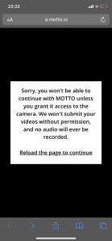

# Titre de l'oeuvre
**MOTTO**
# Nom de l'artiste ou de la firme
- Créeateur: **Vincent Morisset**
- Auteur: **Sean Michael**
- Programmeur: **Édouard Lanctôt-Benoit**
- Monteuse: **Caroline Robert**
# Année de réalisation
**28 mai 2020**
# Nom de l'exposition ou de l'évenement
Lien vers les projets de la ONF: https://www.onf.ca/explorer-tous-les-projets-interactifs/#experience-web
# Lieu de mise en exposition
site de l'experience interactive: https://www.motto.io/
# Date de votre visite
20 février 2020
# Description de l'oeuvre ou du dispositif multimédia
- Vous visiter la vie d'un homme qui vous raconte sa vie et sa rencontre avec un fantôme.
- L'hisoitre se déroule en 6 chapitre.
- Tu dois prendre des photos durant l'histoire.
- Le site met parfois des filtres sur la caméra lorsque tu prend des photo.
- Le site prend les photo prisent durant l'experience et les utilise dans son histoire.
- Tous les visages des personnes présent dans l'histoire son caché par un rectangle de couleur avec un message desus.

 
  
 
# Explication sur la mise en espace de l'oeuvre ou du dispositif
- Le site ne fonctionne que sur téléphone.
- L'experience prend toute l'espace de la page web.
- L'autorisation de la caméra sur internet est nécessaire a l'experience sinon l'histoire ne commencera pas.

- Le téléphone doit être placer a la vertical et non a l'horizontal sinon l'histoire ne commencera pas.

- Il y a des nombres en bas a gauche qui nous indique où nous sommes rendu dans le chapitre.
- Le menu est accessible grace au menu hamburger en bas a gauche.
- Dans le menu il y a des options pour:
1. **Changer de chapitre.**
2. **changer la langue.**
3. **Partager le site.**
4. **Avoir de l'information sur l'expérience interactive.**
5. **Retourner sur le site principal de la ONF.**

# Liste des composantes et techniques de l'oeuvre ou du dispositif
Utilisation de:
 - HTML
 - Css
 - Javascript
 - Bootstrap
 - Fonts:
 1. **Crimson Pro (https://fonts.google.com/specimen/Crimson+Pro)**
 2. **Open Sans (https://fonts.google.com/specimen/Open+Sans)**
# Liste des éléments nécessaires pour la mise en exposition
- Il faut que le site ne marche que sur téléphone puisqu'il serait possible de rednre le site intéractif grâce a la caméra du téléphone du visiteur.
- Le téléphone doit être mit a la verticale pour donner le meilleur résultat (sinon le site ne marche pas).
# Expérience vécue
- Description de votre expérience:

 J'ai beaucoup aimé mon expérience, l'histoire était bien écrit même qu'a certaint moment de l'histoire je trouvais sa drole alors qu'a d'autre moment c'était plus sérieux et un peu triste. J'avais l'inpression de participer dans l'histoire quand le narrateur me demandais de prendres des photos de moi qui faisait une action comme ouvrire une porte et fermer la lumière.
 
 
 
- Ce qui vous a plu:

J'ai aimé que même si le site était restrin a uniquement prendre des photos comme interactivité, il y avait de la variété dans ce qu'il demandait de faire mais que défois ils y avait un filtre sur la l'apparail photo. Personnellement mon moment préférer est dans le chapitre 5 quand on est dans la tête de septembre et que quand elle nous parle, notre caméra est allumé avec un filtre comme si on étais dans un rêve ou quelque part imaginaire, sa donnait vraiment l'inpression qu'on venait de changer de monde.

- Aspect que vous ne souhaiteriez pas retenir pour vos projets création:
 
Un petit affaire qui ma déranger c'est que défois il demandais de dessiner quelque chose et il ne spécifiait pas si sa allais prendre une video ou une photo alors je pense que pour mon prochain projet création je vais faire attention d'être très claire si il y a de l'intéractivié pour ne pas que la personne qui visite se sente perdu.
# référence
lien vers le Motto:https://www.motto.io/
