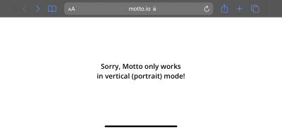

# photographie de l'oeuvre ou du dispositif dans son ensemble

# photographies de composantes de l'oeuvre
# photographies des élément nécessaires a sa mise en espace

# photographie du cartel ou du panneau explicatif

# autoportrait de vous avec l'oeuvre (photo)
# court video pour documenter les actions de l'oeuvre ou l'interactivité
