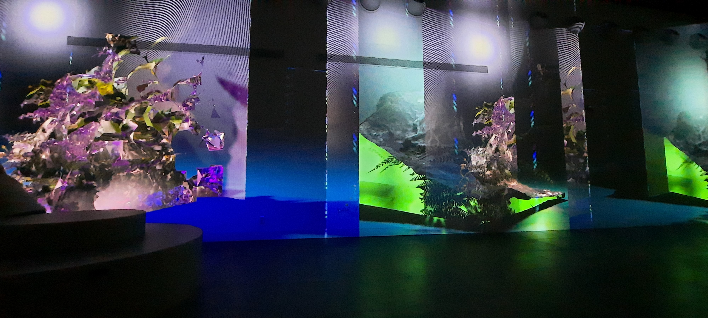

# 👋

# Musé
- **Oasis immersion**
- **Recharger / unwind**
- **Portail**
- 301 rue Saint-Antoine Ouest, Montréal, Québec H2Z 1H5
- Samedi 12 mars 2022
# Oeuvres 
| Core | Floralia | Migration |
|------|----------|-----------|
# Artiste
- Core: **Adrien M & Claire B** (2020)
- Floralia: **Sabrina Ratté** (2021)
- Migration: **Ruban Mauve** (🤷‍♂️)
# Description de l'oeuvre ou du dispositif multimédia
- **Core**: La vidéo projeté est composé de plusieurs points blancs qui couvres le murs au complet. Les points blancs bougent et varient leur mouvement. Des bruits de bouche, des tambours, du trangle, de la guitar, des maracasses et des bruits d'eau se font entendre durant la vidéo

- **Floralia**: La vidéo projeté est composé de plantes et arbres déformer et abstrait qui tourne sur eux mêmes dans un cubes de verre. des grincement, des craquements, du vent, des oiseaux et des insects se font entendres durant la vidéo.

- **Migration**: La vidéo projeté est composé de colline verte qui change de couleur er le mauve et ensuite vers le rouge. Par la suite, les collines se transforment en cristaux vert entrouré d'eau. Des bruits de vent, de téléphone et de respiration accompagnent l'oeuvre.

# Explication sur la mise en espace de l'oeuvre ou du dispositif
Les oeuvres sont dans une très grande salle composé de 4 murs. Il y a 12 projecteurs et 12 haut-parleurs. Il y 3 gros bancs et des petites roches pour s'assir au centre de la salle.

# Liste des éléments nécessaires pour la mise en exposition
Une grande salle avec 4 murs, 12 projecteurs et 12 haut-parleurs. 3 projecteur et 3 haut-parleurs par murs.
# Expérience vécue
- Description de votre expérience

 j'ai trouvé l'expérience très immersive. J'ai trouvé l'oeuvre **Core** très intriguante et diférentes des autres oeuvres puisque c'était uniquement que des points qui bouge. Pour l'oeuvre **Floralisa**, j'ai trouvé l'experience un peu ennuillant puisque ce n'était que des plantes qui tournaieut sur eux même. l'oeuvre **Migration** était très hypnotisante, regarder les montagnes changer de couleurs était très relaxant.
- Ce qui vous a plu

j'ai aimé l'originalité dans l'oeuvre **Core**, l'utilisation de seulement des points est très simple mais j'ai quand même beaucoup aimé les voir bouger a travers les 4 murs en même temps de suivre les bruits. Dans l'oeuvre **Floralisa**, j'ai aimé que les plantes et les arbres était abstrait mais qu'on pouvait quand même comprendre que c'était. Dans l'oeuvre l'oeuvre **Migration**, j'ai aimé les changement de couleur subtil qu'il y avait dans l'oeuvre, sa variait subtilement ce qu'on voyait.
- Aspect que vous ne souhaiteriez pas retenir pour vos projets création

Je pense que j'aurais mit plus d'élément réel dans les salles pour que les visiteurs puissent se promener un peu dans la salle et les pousser inconsciemment a voir les autres mures de la pièce.
# Référence
- Site vers Oasis immersion: https://oasis.im/a-laffiche/
- Site de l'oeuvre Core: https://www.am-cb.net/projets/core
- Site de l'oeuvre Floralia: http://sabrinaratte.com/FLORALIA-2021

