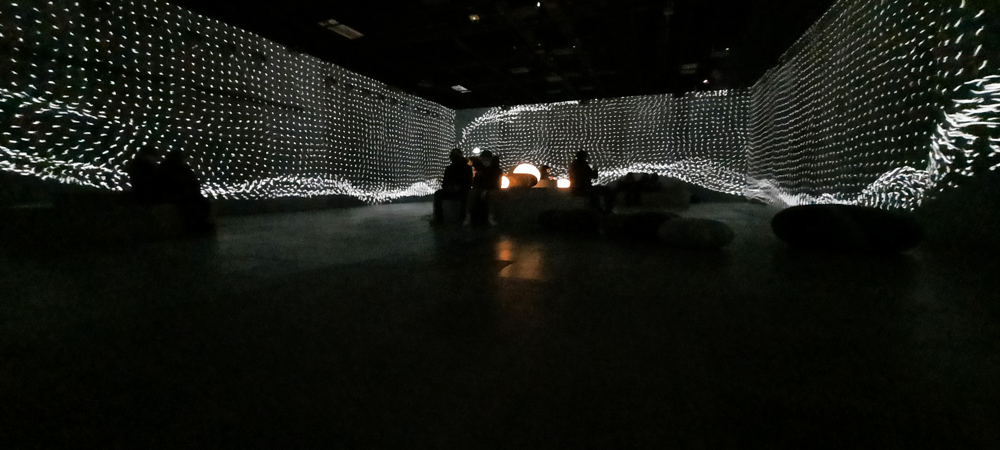

# Photographie de l'oeuvre ou du dispositif dans son ensemble
- Image de **Core**

- Image de **Floralia**

- Image de **Migration**

# Photographies de composantes de l'oeuvre
- Projecteur 
 
- Haut-parleur
 
# Photographies des élément nécessaires a sa mise en espace
 
# Photographie du cartel ou du panneau explicatif

# Autoportrait de vous avec l'oeuvre (photo)

# Court video pour documenter les actions de l'oeuvre ou l'interactivité
