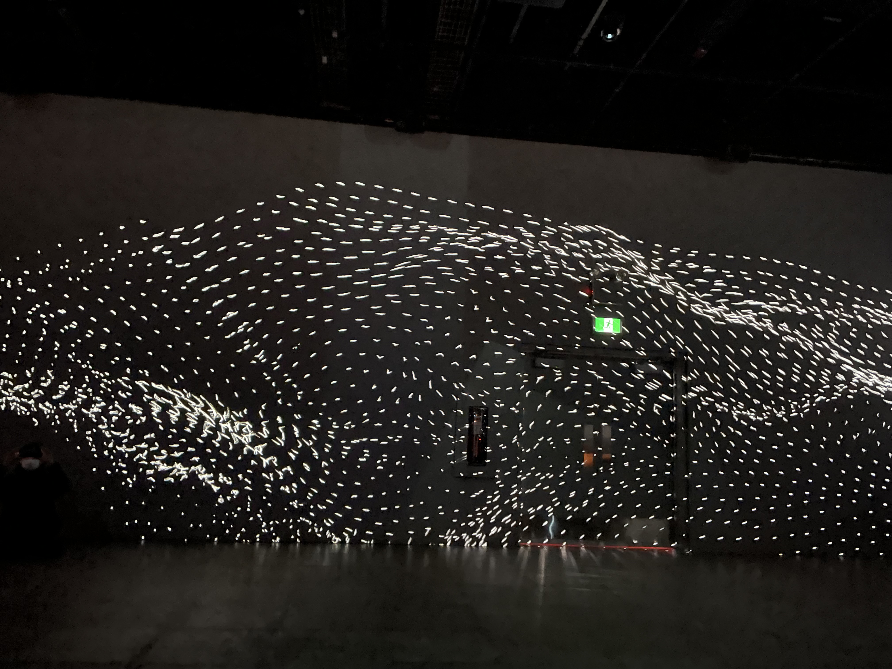
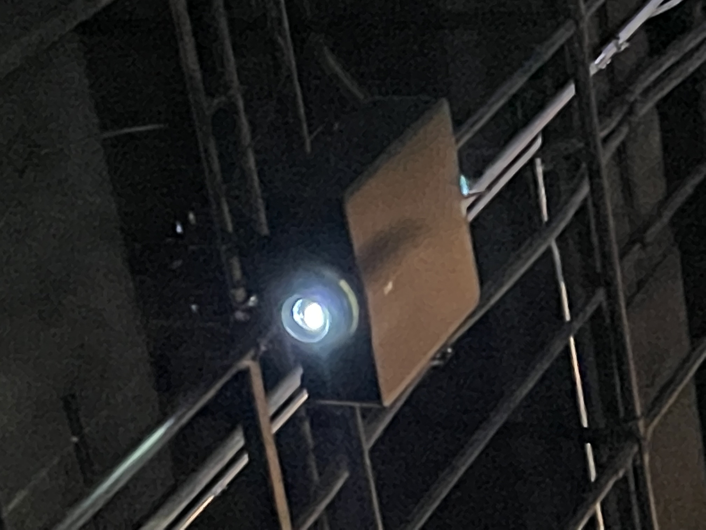
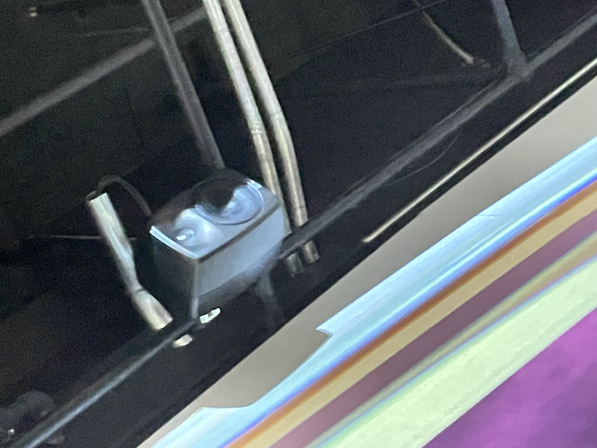

# photographie de l'oeuvre ou du dispositif dans son ensemble
- image de **Core**

- image de **Floralia**

- image de **Migration**

# photographies de composantes de l'oeuvre
 
 
# photographies des élément nécessaires a sa mise en espace

# photographie du cartel ou du panneau explicatif

# autoportrait de vous avec l'oeuvre (photo)

# court video pour documenter les actions de l'oeuvre ou l'interactivité
