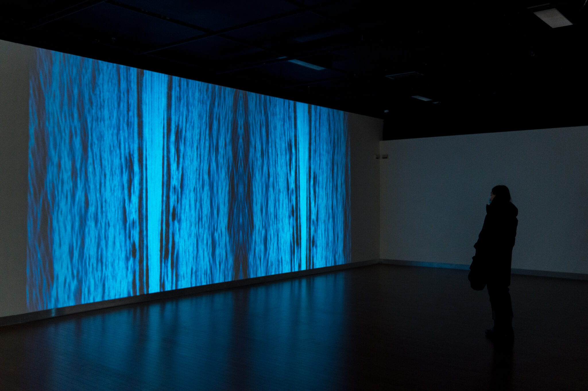

# Titre de l'oeuvre
*Le fleuve, 50° 11'53,"N., 66° 4'10" O.*

source : https://bechardhudon.com/project/sans-titre-no-title-2021/
# Nom de l'artiste ou de la firme
**Bechard Huden**
# Année de réalisation
2022
# Nom de l'exposition ou de l'évenement
**Configuration du sensible**
# Lieu de mise en exposition
**Maison des arts de laval**
# Date de votre visite
Jeudi 17 mars 2022
# Description de l'oeuvre ou du dispositif multimédia
C'est une video de de l'horizon du fleuve du Saint-Laurent, afficher 4 fois a la vertical un a coté de l'autre.
# Explication sur la mise en espace de l'oeuvre ou du dispositif
L'oeuvre est projecter sur un grand mur d'environ 8 mètres de large.
# Liste des composantes et techniques de l'oeuvre ou du dispositif
Pour réaliser la vidéo, l'artiste a probablement utiliser un logiciel d'éditage video comme DaVinci ou encore Adobe Premiere.
# Liste des éléments nécessaires pour la mise en exposition
Une grande pièce avec des long et grands murs pour projecter l'oeuvre.
# Expérience vécue
- Description de votre expérience
 J'ai trouvé l'oeuvre tres relaxante et hypnotisante.
- Ce qui vous a plu
J'ai beaucoup aimé le coté abstrait de l'oeuvre, on ne sais pas vraiment qu'est-ce que nous regardons mais le mouvement calmes et répétitif des vagues donnes envie de le regarder pendant des heures.
- Aspect que vous ne souhaiteriez pas retenir pour vos projets création
Je pense que le vide autours de l'oeuvre aurais pu être remplit, l'artiste aurait pu placer un cadre par exemple. Alors je rentient de penser a mettre un décor sur ma prochaine oeuvre.
# Référence
