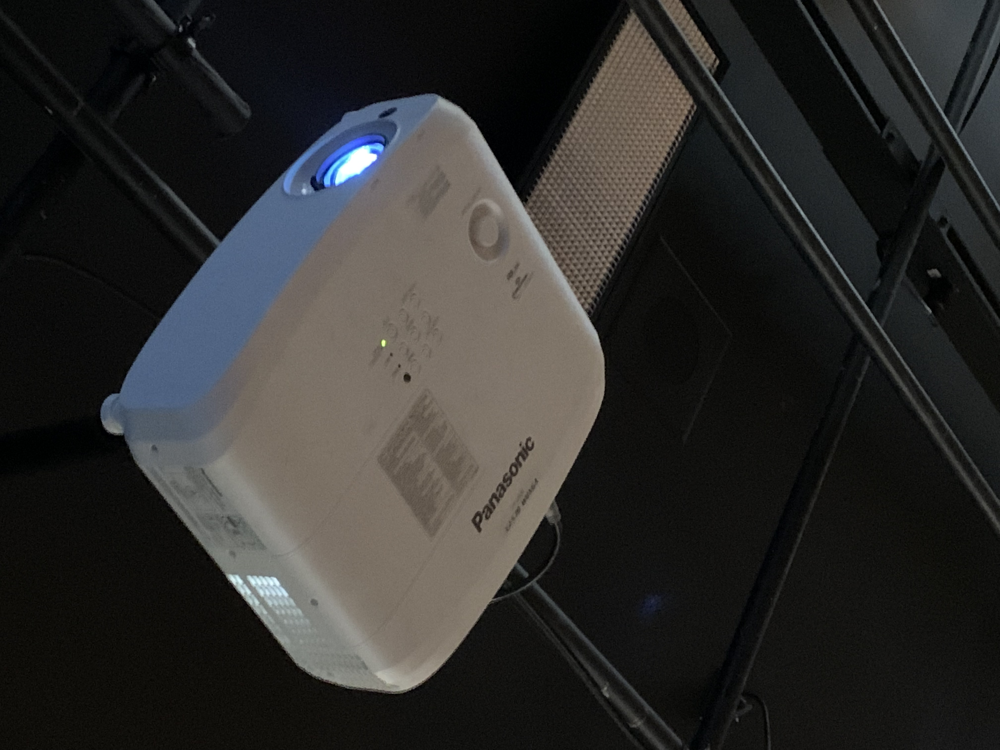
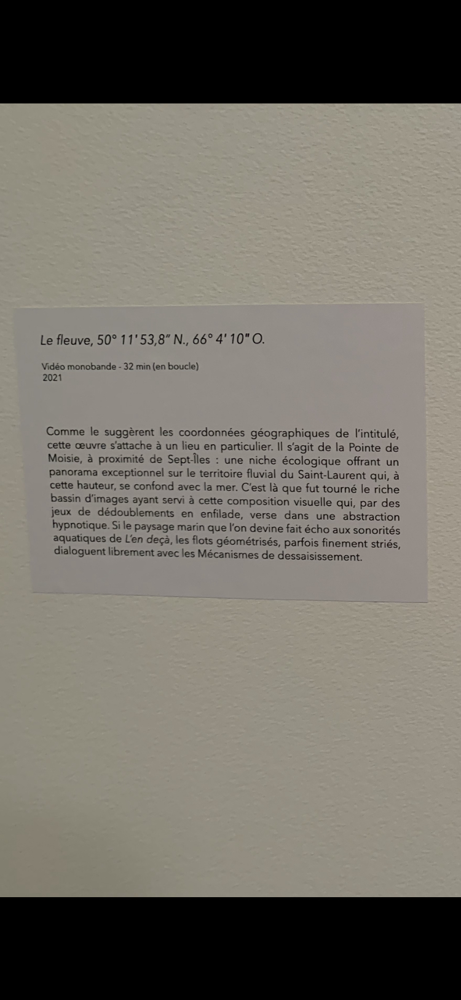

# photographie de l'oeuvre ou du dispositif dans son ensemble

# photographies de composantes de l'oeuvre

# photographies des élément nécessaires a sa mise en espace

# photographie du cartel ou du panneau explicatif

